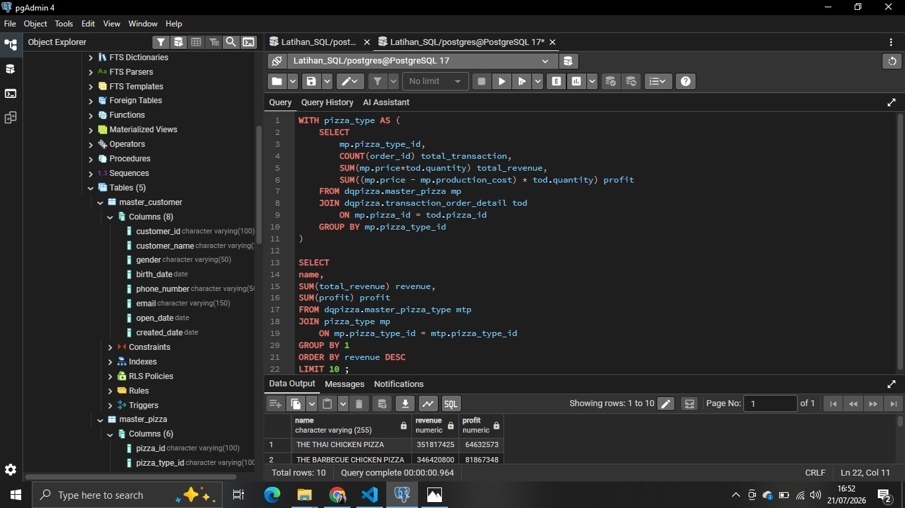
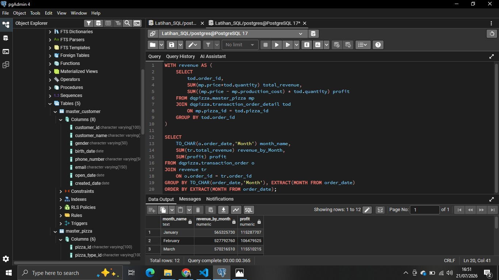
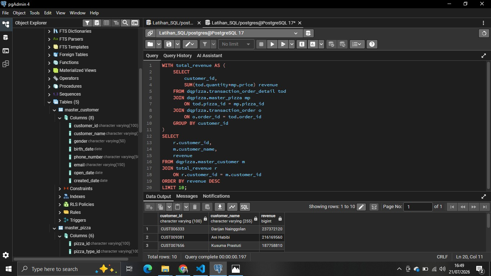

# 🍕 SQL Pizza Sales Analysis

## 📌 Project Overview

This project analyzes pizza sales data using PostgreSQL to uncover business insights. The analysis includes data cleaning, data validation, exploratory data analysis (EDA), and dashboard visualization using Tableau.

---

## 🛠️ Tools Used

- PostgreSQL
- pgAdmin 4
- Tableau Public
- GitHub

---

## 📂 Project Structure

```
SQL-Pizza-Sales-Analysis
│
├── Dashboard
├── Dataset
├── Images
├── SQL
└── README.md
```

---

## 📊 Dashboard


---

## 📈 SQL Analysis

### Total Revenue


### Total Profit


### Revenue and Profit by Pizza Name



### Revenue and Profit by Month



### Top Customer by Revenue



---

## 💡 Key Insights

- Total revenue reached billions of rupiah from pizza sales.
- Monthly revenue trends reveal seasonal sales patterns.
- Several loyal customers contributed significantly to overall revenue.
- Different pizza types generated varying levels of revenue and profit.

---

## 👨‍💻 Author

**Ricky Christian Simatupang**
